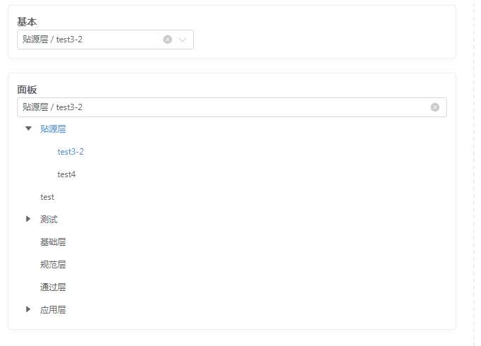

## cascader-tree-select

> 一个级联树形选择控件
> a cascader tree selector

## 🚨🚨 This plugin is Deprecated 🚨🚨

This plugin is deprecated due to it's based on a build tool and a UI Toolkit of my former company. I've considered switching it to Element-ui, but they works differently and too much of a trouble to work out the differences. So this repository is for archival purpose really. But I hope some of the code might work as a inspiration for those who find this. **Thank you!**

### Install
```
npm install @components/cascader-tree-select --registry http://registry.npm.reducted.com
```

### Quick Start
```javascript
import Vue from 'vue';
import CascaderTreeSelect from '@components/cascader-tree-select';
import '@components/cascader-tree-select/lib/style/index.css';

Vue.use(CascaderTreeSelect);
```

### 截图


### 基本用法
```html
<template>
  <div class="demo-wrapper">
    <div class="demo-block">
      <strong>基本</strong>
      <div>
        <cascader-tree-select
          v-model="categorys"
          :props="{
            label: 'label',
            value: 'categoryGuid'
          }"
          :tree-props="{
            accordion: true
          }"
          clearable
          filterable
          change-on-select
          expand-on-click-node
          :width="250"
          :options="categoryOptions || []"
          :before-filter="handleBeforeFilter"
        />
      </div>
    </div>
    <div class="demo-block">
      <strong>面板</strong>
      <div>
        <cascader-tree-panel
          v-model="categorys"
          :props="{
            label: 'label',
            value: 'categoryGuid'
          }"
          :height="0"
          clearable
          filterable
          change-on-select
          expand-on-click-node
          :options="categoryOptions || []"
          :before-filter="handleBeforeFilter"
        />
      </div>
    </div>
  </div>
</template>
```

```javascript
<script>
  export default {
    data() {
      return {
        categorys: ['1', 'a228a8b2-02c7-402c-b112-e43577235db6']
      };
    },

    computed: {
      categoryOptions() {
        return [{
          "guid": "1",
          "name": "贴源层",
          "categoryGuid": "1",
          "disabled": true,
          "children": [{
            "guid": "a228a8b2-02c7-402c-b112-e43577235db6",
            "categoryGuid": "a228a8b2-02c7-402c-b112-e43577235db6",
            "disabled": false,
            "label": "test3-2",
            "title": "安全等级: 中级"
          }, {
            "guid": "495e8d43-6038-47e2-8e73-4c8be1784a58",
            "name": "test4",
            "categoryGuid": "495e8d43-6038-47e2-8e73-4c8be1784a58",
            "disabled": false,
            "label": "test4",
            "title": "安全等级: 低级"
          }],
          "label": "贴源层",
          "title": "安全等级: 中级"
        }, {
          "guid": "fc809745-af2c-4427-bbfe-3a0bf4d149d1",
          "categoryGuid": "fc809745-af2c-4427-bbfe-3a0bf4d149d1",
          "disabled": false,
          "expandDisabled": false,
          "label": "test",
          "title": "安全等级: 高级"
        }, {
          "guid": "1cc44d5f-fdeb-4e0a-b9c2-2d484d59293c",
          "categoryGuid": "1cc44d5f-fdeb-4e0a-b9c2-2d484d59293c",
          "disabled": false,
          "children": [{
            "guid": "1a9159e4-ffc9-4d85-89b6-88cce9f71e43",
            "name": "测试-前",
            "categoryGuid": "1a9159e4-ffc9-4d85-89b6-88cce9f71e43",
            "disabled": false,
            "label": "测试-前",
            "title": "安全等级: 低级"
          }, {
            "guid": "baab1f69-82cb-42ab-8dda-7225c6074c91",
            "categoryGuid": "baab1f69-82cb-42ab-8dda-7225c6074c91",
            "disabled": false,
            "label": "test-c",
            "title": "安全等级: 高级"
          }],
          "label": "测试",
          "title": "安全等级: -"
        }, {
          "guid": "2",
          "categoryGuid": "2",
          "disabled": false,
          "label": "基础层",
          "title": "安全等级: 高级"
        }, {
          "guid": "3",
          "name": "规范层",
          "categoryGuid": "3",
          "disabled": false,
          "label": "规范层",
          "title": "安全等级: -"
        }, {
          "guid": "4",
          "categoryGuid": "4",
          "disabled": false,
          "label": "通过层",
          "title": "安全等级: -"
        }, {
          "guid": "5",
          "categoryGuid": "5",
          "disabled": false,
          "expandDisabled": true,
          "children": [{
            "guid": "14a6b640-9299-41c4-b042-a6e078133aaa",
            "name": "测试应用",
            "categoryGuid": "14a6b640-9299-41c4-b042-a6e078133aaa",
            "disabled": false,
            "label": "测试应用",
            "title": "安全等级: 中级"
          }],
          "label": "应用层",
          "title": "安全等级: -"
        }];
      }
    },

    methods: {
      handleBeforeFilter(val) {
        return !val.includes('ignore');
      },
      filterNode(val, data) {
        return true;
      },
      lazyLoad(node, resolve) {
        setTimeout(() => {
          resolve([{
            label: 'lazy' + Math.floor(Math.random() * 100),
            categoryGuid: 'load' + Math.floor(Math.random() * 100),
            leaf: true
          }]);
        }, 200);
      }
    }
  };
</script>
```

### CascaderTreeSelect props

| 参数   | 说明  | 类型  | 可选值  | 默认值  |
|----------|---------|---------|-----------|-----------|
| props | 配置选项，具体见下表 | Object  | - | - |
| popover-props | popover配置选项，具体可以参考 `gs-popover` 的文档 | Object  | - | - |
| tree-props | tree配置选项，具体可以参考 `gs-tree` 的文档 | Object  | - | - |
| value | 选中项绑定值 | Array  | - | - |
| options | 可选项数据源，键名可通过 `props` 属性配置 | Array  | - | - |
| validate-event | Form 表单中使用，是否作为 Form 表单的数据校验项 | Boolean  | - | true |
| placeholder | 输入框占位文本 | String  | - | 请选择 |
| separator | 分隔符号 | String  | - | / |
| disabled | 是否禁用 | Boolean  | - | false |
| clearable | 是否支持清空选项 | Boolean  | - | false |
| change-on-select | 是否允许选择任意一级的选项 | Boolean  | - | false |
| show-all-levels | 输入框中是否显示选中值的完整路径 | Object  | - | true |
| expand-on-click-node | 点击节点展开或折叠 | Object  | - | false |
| default-expanded-keys | 默认展开的节点的 key 的数组 | Array  | - | - |
| height | 下拉选项滚动区的最大高度，设为0时无高度限制 | Number  | - | 200 |
| width | 数字输入框宽度，使用number类型时单位为px，使用string类型需给上单位 | String, Number  | - | - |
| render-content | 树节点的内容区的渲染 Function | Function(h, {node, data})  | - | - |
| filterable | 是否可搜索选项，可配合 `filter-node-method` 使用，`filter-node-method` 不设置时，默认对label进行筛选 | Boolean  | - | false |
| debounce | 搜索关键词输入的去抖延迟，毫秒 | Number  | - | 300 |
| before-filter | 筛选之前的钩子，参数为输入的值，若返回 false 或者返回 Promise 且被 reject，则停止筛选 | Function(value)  | - | - |
| filter-node-method | 对树节点进行筛选时执行的方法，返回 true 表示这个节点可以显示，返回 false 则表示这个节点会被隐藏 | Function(value, data)  | - | - |
| no-match-tip | 无匹配结果文本 | String  | - | 无匹配数据 |
| lazy | 开启懒加载模式，需要配置load函数 | Boolean  | - | false |
| load | 	加载子树数据的方法	 | Function(node, resolve)	  | - | - |

### Option props
| 参数   | 说明  | 类型  | 可选值  | 默认值  |
|----------|---------|---------|-----------|-----------|
| label | 指定节点标签为节点对象的某个属性值 | String  | - | label |
| value | 指定节点的值为节点、选项对象的某个属性值 | String  | - | value |
| children | 指定子树为节点对象的某个属性值 | String  | - | children |
| disabled | 指定节点被禁用的属性值 | String  | - | disabled |
| expandDisabled | 指定节点无法展开的属性值 | String  | - | expandDisabled |
| className | 为当前节点添加 `class` | String  | Array | Object |

### CascaderTreeSelect events
| 事件名称   | 说明  | 回调参数  |
|----------|---------|---------|
| visible-change | 下拉选项显示状态变化事件 | true/false |
| change | 当绑定值变化时触发的事件 | 当前值 |
| node-click | 当前节点点击触发的事件 | 共两个参数，当前的Node对象以及事件对象 |
| content-click | 点击当前节点的内容触发的事件（自定义内容渲染时无效） | 共两个参数，当前的Node对象以及事件对象 |
| node-toggle | 节点展开或关闭时触发的事件 | 共两个参数，当前的Node对象以及是否展开 |
| current-change | 当前选中节点变化时触发的事件 | 共两个参数，当前的Node对象以及是否选中 |
| check-change | 节点选中状态发生变化时的回调 | 共三个参数，依次为：当前的Node对象，是否选中以及是否半选（indeterminate） |

### CascaderTreeSelect method
|    方法名   | 说明  |   参数  |
|----------|---------|---------|
| clearFilter | 清除当前筛选 | - |

### CascaderTreePanel props
除了参数 `popover-props` 无效之外，其余与上述 `CascaderTreeSelect props` 一致

### CascaderTreePanel events
除了事件 `visible-change` 不存在之外，其余与上述 `CascaderTreeSelect events` 一致

### CascaderTreePanel method
与上述 `CascaderTreeSelect method` 一致


### 更新记录
  - `1.1.2`：更好地支持gs-form校验

### Build Setup

> 项目构建说明请参考：[打包构建](https://gitlab.reducted.com/frontend/gs-ui/elf/wikis/home)

> 组件文档编写规范：[组件文档约定](http://gs-ui.reducted.com/#/zh-CN/component/docs-guide)

* 下载安装依赖

```shell
npm install
```

* 启动开发环境

```shell
npm start
```

浏览器打开 http://localhost:10001 即可看到效果

* 构建打包

```shell
npm run build
```


